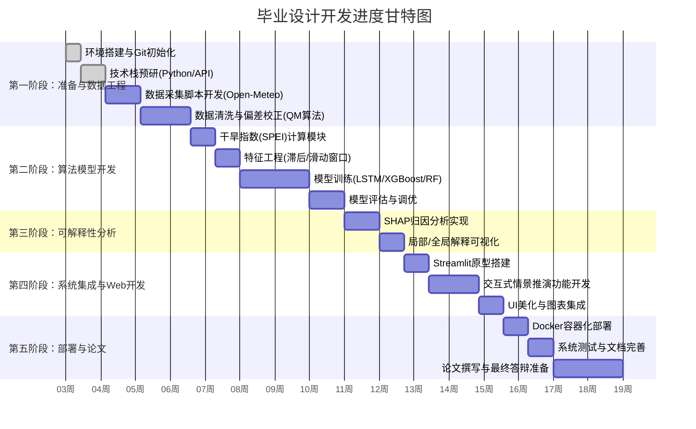

# 项目学习与开发规划书 (Reference Timeline & Feasibility Plan)

**基于文档版本**：Tech-Roadmap V2
**项目目标**：构建华北平原水资源干枯状态分析及可视化系统

---

## 1. 总体进度规划 (Gantt Chart)

本计划将开发周期划分为五个主要阶段，预计总周期为 12-16 周（约3-4个月）。

---

## 2. 详细阶段拆解与学习目标

### 🌟 第一阶段：基础设施与数据工程 (预计 3-4 周)

**🎯 阶段目标**：
完成数据流水线搭建，实现从API获取数据并进行清洗和偏差校正，存入数据库。

**📚 学习重点**：
- **Python进阶**：掌握 `requests` 异步请求、`pandas` 高级数据清洗。
- **气象知识**：理解 ERA5-Land 数据结构、分位数映射（Quantile Mapping）原理。
- **数据库**：PostgreSQL/TimescaleDB 的基本操作与时序数据存储。

**✅ 交付物 (Milestone 1)**：
- [ ] 可运行的数据采集脚本 (`data_collection.py`)。
- [ ] 清洗后的高质量数据集（CSV或数据库表）。
- [ ] 偏差校正前后的对比分析报告（简单的Jupyter Notebook）。

---

### 🌟 第二阶段：核心算法与模型构建 (预计 4-5 周)

**🎯 阶段目标**：
构建并训练 LSTM、XGBoost 和 Random Forest 模型，能够对未来 SPEI 进行有效预测。

**📚 学习重点**：
- **机器学习**：深入理解 LSTM 时间序列预测机制、XGBoost 原理。
- **特征工程**：学习如何构建滞后特征（Lagged Features）和滑动窗口统计量。
- **指标计算**：掌握 Penman-Monteith 公式和 SPEI 计算逻辑。

**✅ 交付物 (Milestone 2)**：
- [ ] SPEI 计算模块。
- [ ] 训练好的三个模型文件 (`.pkl` 或 `.h5`)。
- [ ] 模型性能对比报告（包含 RMSE, R2, MAE 等指标）。

---

### 🌟 第三阶段：可解释性与系统开发 (预计 4-5 周)

**🎯 阶段目标**：
引入 SHAP 解释模型，并利用 Streamlit 搭建完整的前端可视化系统。

**📚 学习重点**：
- **可解释性 AI**：学习 SHAP 库的使用，理解 Shapley 值含义。
- **Web 开发**：精通 Streamlit 框架，掌握 `st.session_state` 状态管理。
- **可视化**：学习 Plotly 交互式绘图。

**✅ 交付物 (Milestone 3)**：
- [ ] SHAP 解释图表（摘要图、力图）。
- [ ] 完整的 Web 系统源码。
- [ ] 具备“情景推演”功能的交互界面。

---

### 🌟 第四阶段：部署、测试与论文 (预计 2-3 周)

**🎯 阶段目标**：
将系统容器化，确保可移植性，并完成最终的文档和论文工作。

**📚 学习重点**：
- **DevOps**：学习 Dockerfile 编写和 Docker Compose 编排。
- **学术写作**：规范化论文撰写。

**✅ 交付物 (Final Delivery)**：
- [ ] `docker-compose.yml` 文件，可一键启动系统。
- [ ] 最终演示 PPT 和 系统操作手册。
- [ ] 毕业设计论文初稿。

---

## 3. 可行性分析与风险评估 (Feasibility Plan)

### ✅ 技术可行性
- **数据源**：Open-Meteo 免费且无需 Key，NOAA 数据公开，数据获取门槛低，风险小。
- **算法栈**：LSTM 和 XGBoost 均为成熟算法，Python 生态中有现成的 `tensorflow`/`pytorch` 和 `xgboost` 库支持，实现难度可控。
- **开发栈**：Streamlit 极大地降低了 Web 开发门槛，无需深厚的前端功底（HTML/JS）即可构建美观的界面，非常适合单人完成的毕业设计。

### ⚠️ 潜在风险与应对策略

| 风险点 | 风险描述 | 应对策略 |
| :--- | :--- | :--- |
| **数据质量风险** | 再分析数据与站点数据偏差过大，校正效果不佳。 | 1. 早期进行小样本验证； 2. 备选方案：若QM方法太难，可降级使用简单的线性缩放（Linear Scaling）。 |
| **模型训练风险** | LSTM 训练耗时过长或难以收敛（过拟合）。 | 1. 优先使用 XGBoost 跑通流程（通常更快且效果不错）； 2. 简化网络结构，减少层数； 3. 使用 Google Colab 等免费 GPU 资源。 |
| **进度延期风险** | 论文写作与编码时间冲突。 | 1. **严格遵循本计划的时间线**； 2. 采用“开发日志”驱动写作，开发过程中的文档直接转化为论文素材； 3. 保持每周产出，避免最后突击。 |
| **系统部署风险** | Docker 环境配置复杂，依赖包冲突。 | 1. 开发初期就使用虚拟环境 (`venv`) 管理依赖； 2. 尽早编写 `requirements.txt`； 3. 若 Docker 实在困难，可直接演示本地运行版本（Localhost）。 |

### 🚀 最终成果预期
1. **一个系统**：基于 Web 的华北平原干旱监测与预警平台。
2. **一套代码**：结构清晰、注释完备的 Python 工程源码。
3. **一篇论文**：包含详细技术实现、模型对比和成因分析的学术论文。

---

